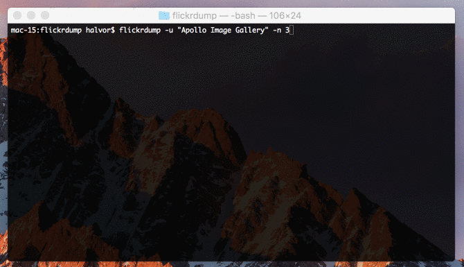

# flickrdump

Basically a script put together in a hurry to dump all the pictures belonging to single Flickr user in the original size. I have done no testing what so ever, and pretty much only made this to dump all the NASA Apollo pictures. All photos in an album is downloaded concurrently so beware it will likely hog your bandwidth if you are using more than 10. Default number of concurrent http calls is 4. It also skips already downloaded files so you can resume easily

### Installation
```
go get -u github.com/hdhauk/flickrdump
```
or if you don't have Go installed simply download the correct binary
* Windows
  * [64-bit](./bin/flickrdump_windows_amd64.exe)
  * [32-bit](./bin/flickrdump_windows_386.exe)
* [MacOS](./bin/flickrdump_darwin_amd64)
* Linux
  * [64-bit](./bin/flickrdump_linux_amd64)
  * [32-bit](./bin/flickrdump_linux_386)

You will also need a Flickr API key [here](https://www.flickr.com/services/api/misc.api_keys.html).

### Example
```
flickrdump -key <your-key> -u "Apollo Image Gallery" -n 5
```
or simply: `flickrdump` (/`flickrdump.exe` for windows)


